# 【分享】fnOS 远程 UPS 解决方案 — 让 fnOS 接入网络共享 UPS

## 前言

飞牛 NAS（fnOS）的 UPS 管理功能仅支持直接连接本机的 USB UPS 设备，无法识别通过网络共享的 UPS。如果你已经有一台 NUT 服务器共享 UPS（比如接在路由器、另一台 NAS 上的 UPS），fnOS 就无法使用。

为此我写了一个开源工具 **fnos-remote-ups**，可以完美解决这个问题。

> 📷 **整体架构示意图**


> 📷 **fnOS UPS 管理页面 UPS 设备识别图**

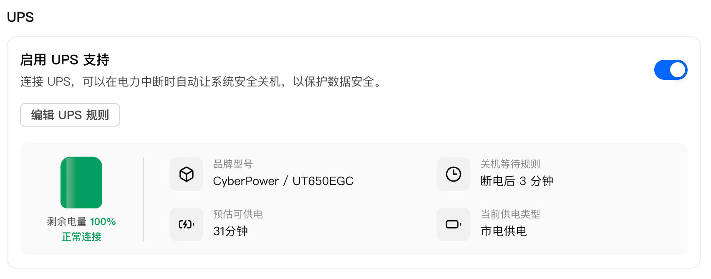


## 功能特点

- 🔌 **USB/IP 协议模拟** — 将远程 NUT UPS 模拟为本地 USB HID UPS 设备
- 📊 **实时状态同步** — 输入/输出电压、电池电量、负载、剩余时间等
- ✅ **fnOS 原生兼容** — 模拟标准 USB HID UPS，fnOS 无缝识别
- 🐳 **Docker 部署** — Docker部署, 简单便捷
- 🚀 **自动挂载** — 支持自动调用 usbip attach 自动挂载设备


## 准备设置

### 开启飞牛系统 SSH 权限

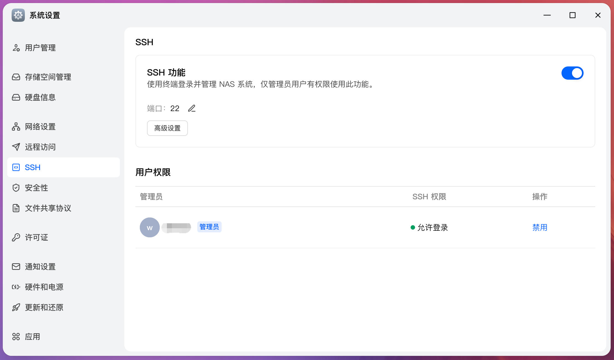

### 准备 SSH 客户端 (可选)

> 如果有常用的 SSH 客户端, 可以直接跳过本步骤，使用你的 SSH 客户端即可

**通过 Docker 镜像连接 SSH**

1. 飞牛 Docker 下载 Alpine Linux 轻量系统镜像 (搜索并点击下载镜像)
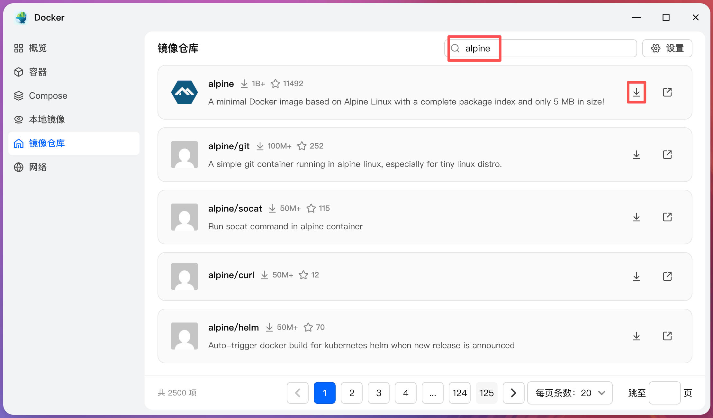

2. 创建 Alpine 容器

   如图选择 alpine 镜像, 其他设置使用默认设置, 下一步完成创建容器

   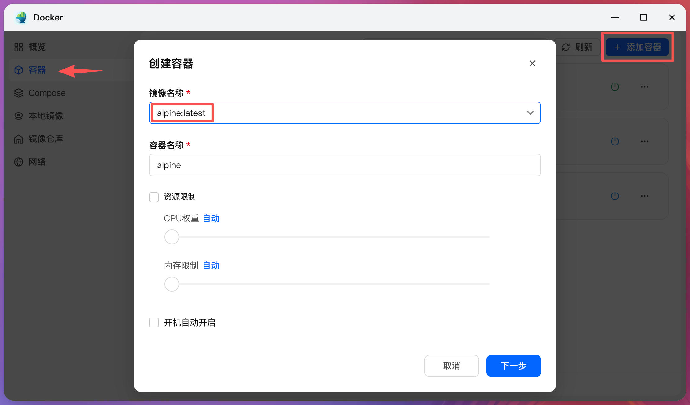

3. 进入终端界面

   点击 alpine 容器详情, 点击 `终端机` 图表, 然后选择 `/bin/ash` 连接打开终端界面

   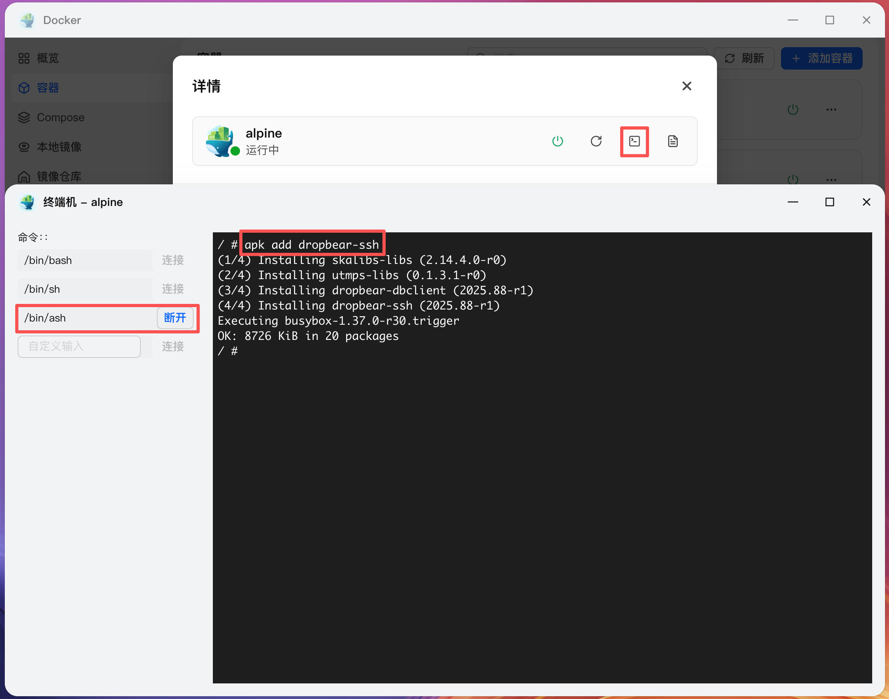

4. 安装 SSH 客户端

   如上图所示, 在终端界面中输入命令: `apk add dropbear-ssh` 等待安装完成


## SSH 登录飞牛系统

通过飞牛管理员账号登录飞牛系统 SSH, 下面以 Docker 终端举例说明, 其他客户端配置方式可自行查找设置方法.

1. 在上一步的终端机界面中输入命令: `ssh {管理员用户名}@{fnOS IP地址}` (用实际用户名和IP地址替换)
2. 首次连接, 输入 `y` 确认服务器指纹
3. 输入用户登录密码回车确认登录
4. 切换到 root 系统用户, 输入命令 `sudo su -l`

**登录命令行截图**

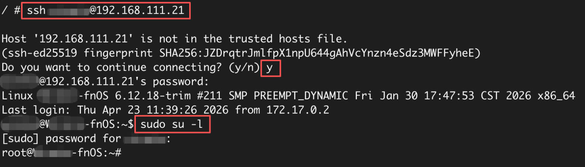


## Docker 部署

### 第一步：安装 usbip 并加载内核模块

```bash
sudo apt-get install usbip
sudo modprobe vhci-hcd
# 开机自动加载
echo "vhci-hcd" | sudo tee -a /etc/modules
```

### 第二步：导入 Docker 镜像

1. 从 [GitHub Releases](https://github.com/GeekXtop/fnos-remote-ups/releases) 下载最新版本的 `.docker.img.gz` 文件

2. 通过飞牛 Web 界面上传镜像文件到飞牛系统中, 并复制镜像的原始路径

   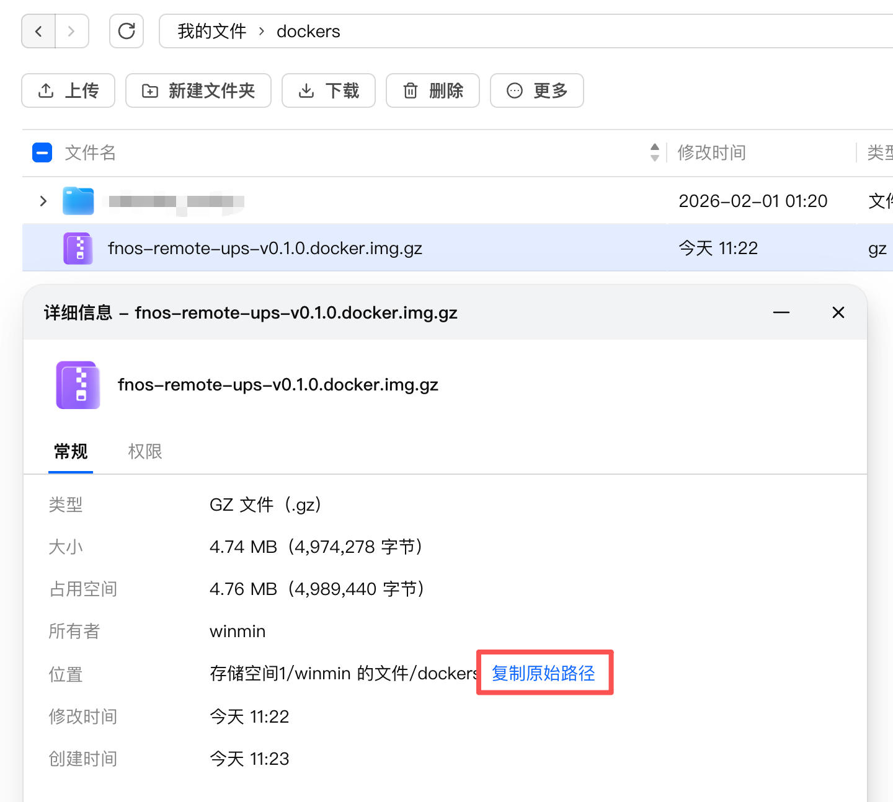

3. 在终端中导入 Docker 镜像

```bash
# 导入镜像
docker image load -i "<docker镜像文件原始路径>"

# 确认导入成功
docker images | grep fnos-remote-ups
```

> 📷 **Docker 镜像导入成功**
>
> 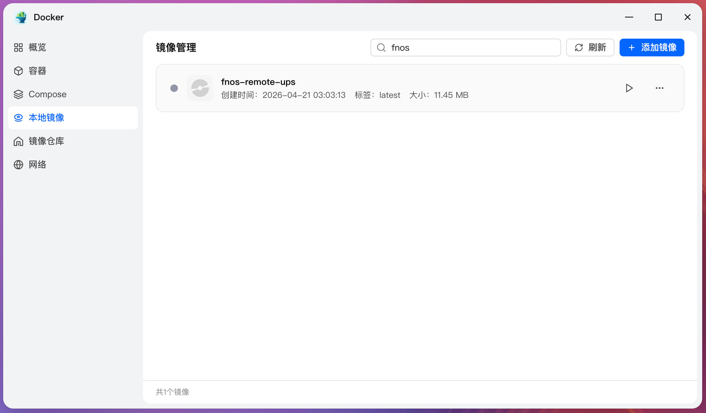


### 第三步：启动容器

#### 方式一：命令行启动

```bash
docker run -d \
  --name fnos-remote-ups \
  --privileged \
  --network host \
  --restart unless-stopped \
  -e REMOTE_UPS="myups@192.168.1.100" \
  fnos-remote-ups:latest
```

- `--privileged` : 以特权模式运行, 自动挂载设备需要, 如果不需要自动挂载, 可以使用普通权限模式运行
- `--network host` : 支持自动挂载时默认使用 `127.0.0.1` 地址进行挂载


#### 方式二：使用飞牛 Docker 应用创建

1. 创建容器, 选择镜像名称 `fnos-remote-ups:latest`, 勾选 `开机自动开启`
   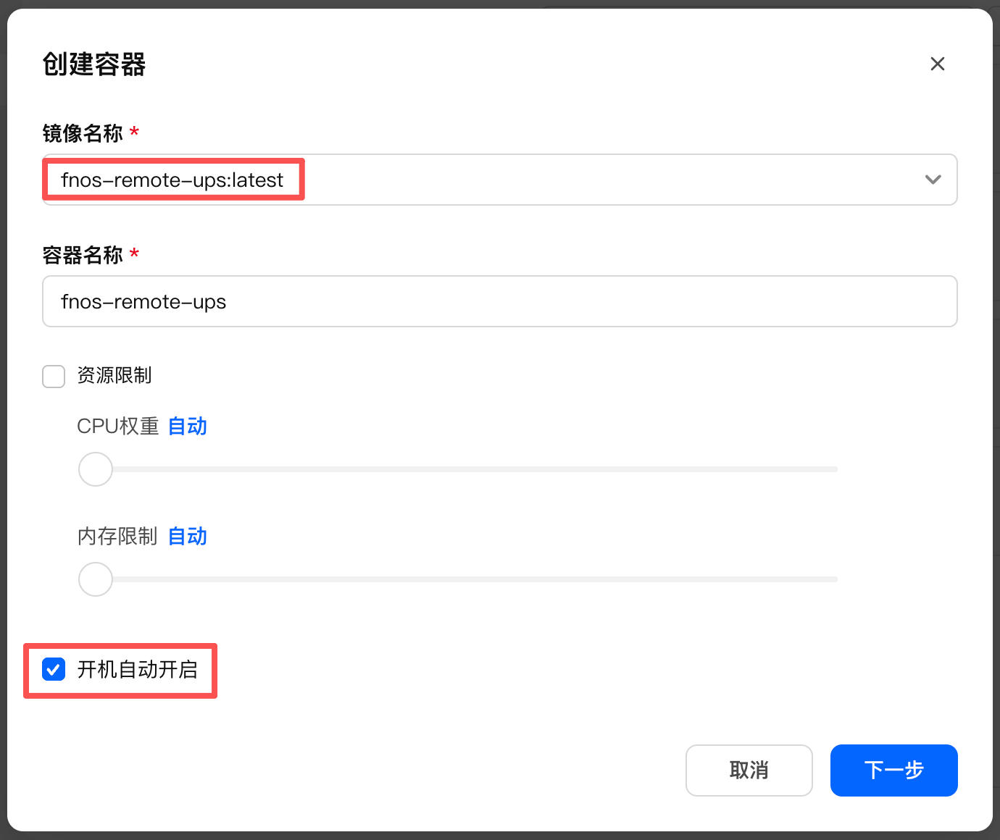

2. 设置远程 NUT UPS 地址环境变量 `REMOTE_UPS`, 自动挂载 `AUTO_MOUNT` 保持为 `true`
   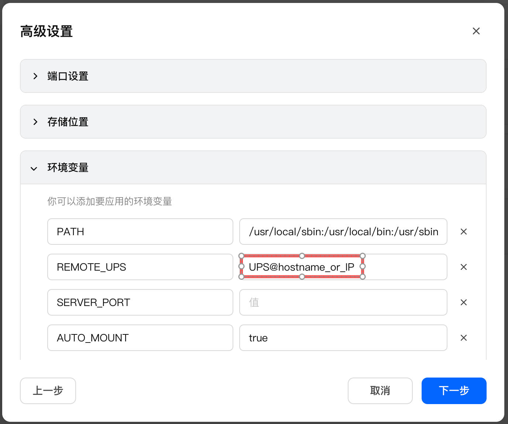

3. 开启 `使用高权限执行容器` 支持自动挂载, 网络模式改为 `host` 支持使用本地IP `127.0.0.1` 挂载设备
   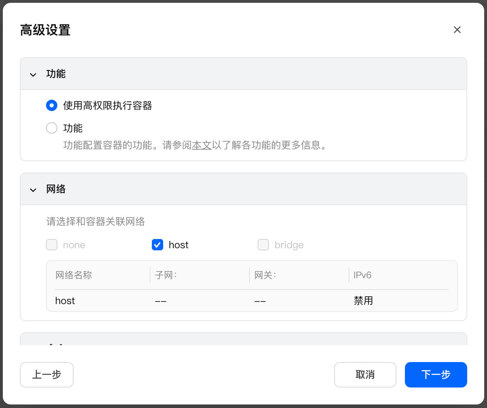

4. 设置完成, 点击保存即可


#### 环境变量说明

| 变量 | 默认值 | 说明 |
|------|--------|------|
| `REMOTE_UPS` | 必填 | NUT UPS 标识符，格式：`ups_name@host[:port]` |
| `SERVER_PORT` | `3240` | USB/IP 监听端口 |
| `AUTO_MOUNT` | `true` | `true`：自动挂载到本机;<br>`host:port@bus-id`：挂载到指定地址;<br> 留空则不自动挂载 |
| `DEVICE_VENDOR_ID` | `04d8` | USB 厂商 ID，十六进制 |
| `DEVICE_PRODUCT_ID` | `d005` | USB 产品 ID，十六进制 |


### 查看运行状态

通过命令行查看容器运行日志和 USB 设备挂载情况

```bash
# 查看日志
sudo docker logs fnos-remote-ups

# 确认设备挂载
lsusb | grep 04d8:d005
```

通过飞牛 Docker 应用查看运行日志

> 📷 **容器运行日志截图**
>
> 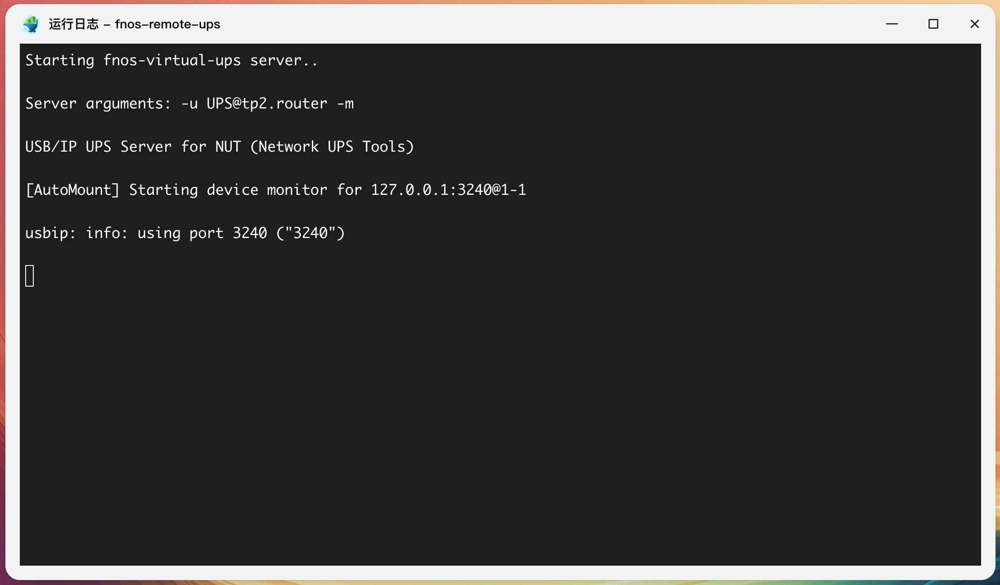


## 验证效果

挂载成功后，fnOS 的 UPS 管理页面应能检测到虚拟 USB UPS 设备：

> 📷 **fnOS 识别到 UPS 设备并显示正常**
>
> 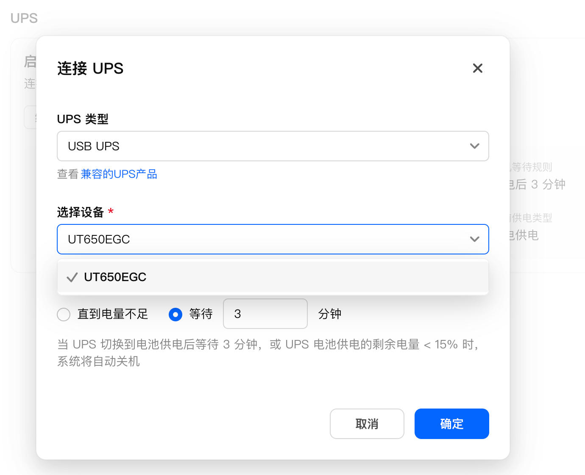

> 📷 **设置完成 fnOS 成功识别 UPS 设备**
>
> 


## 清理设置

1. 设置完成后，即可断开终端，停止 `alpine` 容器并删除, 本工具并不依赖 `alpine` 容器运行
2. 可根据需要， 关闭飞牛系统的 SSH 登录权限，提高安全性


## 项目信息

- 🏠 **GitHub 地址**：https://github.com/GeekXtop/fnos-remote-ups
- 📦 **Releases 下载**：https://github.com/GeekXtop/fnos-remote-ups/releases
- 👤 **开发者**：Winmin

## 写在最后

如果你也在使用 fnOS 并且有网络共享 UPS 的需求，不妨试试这个工具。遇到问题可以在 GitHub 提 Issue，也欢迎 Star 支持一下！
